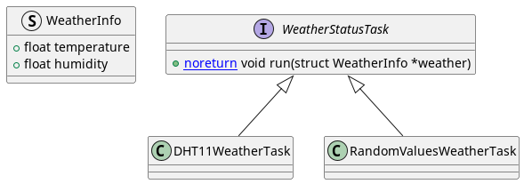

# Weather Station with Raspberry PI Zero 2W

In this project was implemented a simple Temperature and Humidity station using Raspberry PI Zero 2W
and a LCD display.

One thing involved was tthe conditional compilation.
And in Hardware the developer had to solder the LCD header pins

## Dependencies

- [pigpio](http://abyz.me.uk/rpi/pigpio/cif.html) (Usually comes pre-installed on pi boards)
- pthreads: `sudo apt-get install libpthread-stubs0-dev`
  - Make DHT11 Workers. 
- spdlog: `pacman -S spdlog`
  - Simple and Fast Logging Library

## Schematics

    

# Code Structure

### Display

There's an `interface` that dictates the way all the data will be set on display: the `TextBasedDisplay`

    

### WeatherStatusTask

There's an `interface` that dictates the way the weather is acquired. The data will be scoped in a single
struct named `WeatherInfo`.

    

## References

- [Controle de GPIO da Raspberry Pi utilizando a linguagem C](https://embarcados.com.br/gpio-da-raspberry-pi-linguagem-c/)
- [bcm2835](http://www.airspayce.com/mikem/bcm2835/)
- [pigpio](http://abyz.me.uk/rpi/pigpio/index.html)
